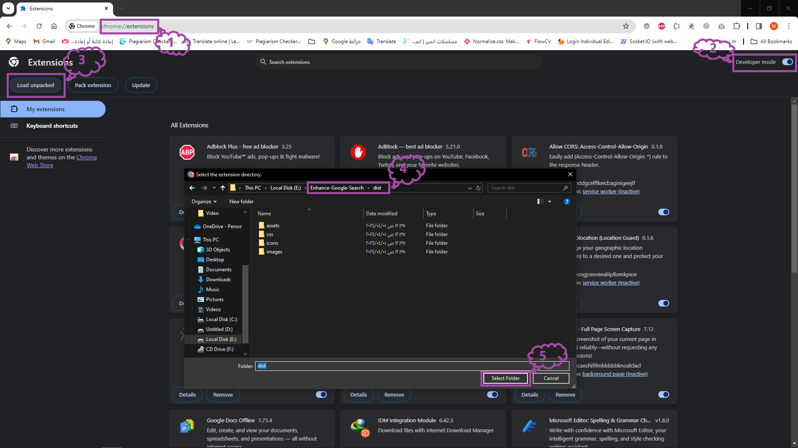

# IMDB🌟: (Enhance Google Search)

**Description**
<br/>
IMDB is your go-to browser extension for enhancing search engine results. Instantly access comprehensive information on movies and series without leaving your search page. 🚥


## Technologies

-   HTML.
-   CSS.
-   JavaScript - TypeScript.
-   Axios.
-   TMDB API.
-   Jest.

## Overview

-   This extension will help you to get more data about movies and series from TMDB API. All this will done on Google SERP page.
-   You can customize the results by deactivating the extension or even changing the number of results from one to twenty. Note that it will be a happy scenario if you get twenty results, as there are many nominations being done behind the seen.

## Setup

-   Please first make sure you got the env key from my latest E-mail. Make sure that you have **Node.js** and **git** installed on your machine.
-   Open **Command Prompt** into you machine, then clone the repository by copy and past the text bellow into **Command Prompt**.

```
git clone https://github.com/mahmoudkandel980/Enhance-Google-Search.git
```

-   After cloning it, you have to install the dependencies. Please make sure you navigate to the repository directory into your machine, then run the comand bellow.

```
npm install
```

### Scripts :-

**Development**

-   After installing dependencies, in the same directory run the command bellow.

```
npm run dev
```

-   When run this script only you will show is only the view of extension.

<br/>

**Test**

-   After installing dependencies, in the same directory run the command bellow.

```
npm run test
```

-   Run this script to show some testing functions results.

**Build**

-   After installing dependencies, in the same directory run the command bellow.

```
npm run build
```

-   After making all steps above, open **Google Ghrome** and navigate to the link i provided to you bellow.

```
chrome://extensions/
```

-   After moving to this link you will find at the top right **Developer mode** please activate it.
-   After activate **Developer mode**, then at the top left on the same page you will find a button called **Load unpacked**, click on it and select to **dist** directory this directory you will find on the first indentation of the repository folder into your machine.
    
-   Congratulation 🥳🔥 you now install IMDB extension into your browser.

-   You can now go to Google search and customize results per page and toggle activation of the extension.
    
    
    

<br/>
<br/>

## Optional

**Create VITE_API_KEY**

-   Please go to this link below and create an acount in TMDB.

```
https://www.themoviedb.org/signup
```

-   After login and verify your account, click in your profile image in the top right of the screen and choose settings.
    
-   Then, navigate to API and click on then link named **click here** you will find it on photo i provided to you
    
-   You will be redirected to another page. Please select a developer.
    
-   You will be redirected to the Terms and Conditions page. Please scroll down and click **Accept** button.
    
-   You will be redirected to page, Please fill the form. then you will got the api key
    
    
